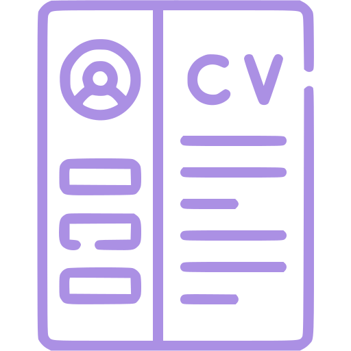

### Hello there 👋
...General kenobi
<!--
**MisterZurg/MisterZurg** is a ✨ _special_ ✨ repository because its `README.md` (this file) appears on your GitHub profile. 
-->
<h3 align="center">An undergraduate student at SPbSUT, future security software engineer and longlife learner</h3>

### My Cv 

 

### 💬 Social
|   | ||||
|----|----|----|----|----|----|

### 💬 Learning
|||<a href="https://leetcode.com/MisterZurg/">||
|----|----|----|----|----|

### 💬 Interests
|||||
|----|----|----|----|----|
||||

- ⚙️ I’m currently working on Project: [ACSL Language Support 4 VS Code](https://frama-c.com/html/acsl.html)
- 💡 I’m currently learning [Data Structures and Algorithms Specialization](https://www.coursera.org/specializations/data-structures-algorithms)
- 📘 Also I’m learning [Ликбез по дискретной математике](https://stepik.org/course/91/info)
- 📖 I’m currently reading "Cracking the Coding Interview" by McDowell Gayle Laakmann
- ⚡ Fun fact: Мой любимый цвет - весенний!

## Skills, Languages, Frameworks and Stuff
|Prof.|||| |
|----|----|----|----|----|----|
|| ||||| 

|Famil.|||||
|----|----|----|----|----|----|
||||||
||

## IDE's
|||||
|----|----|----|----|----|

## Natural Languages
|||||
|----|----|----|----|----|

<!--  -->

 
 
 

 
  
  

