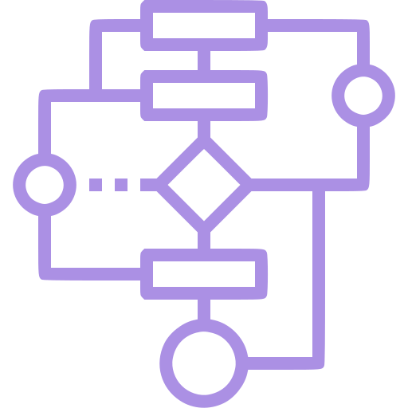

### Hello there 👋
...General kenobi
<!--
**MisterZurg/MisterZurg** is a ✨ _special_ ✨ repository because its `README.md` (this file) appears on your GitHub profile. 
-->
<h3 align="center">5Head longlife learner</h3>

### Education
|University|Description|
|----|----|
||$(2022 \;— \;now)$ Currently persuing Master Degree in Big Data and Machine Learning|
||$(2018 \;— \;2022)$ Bachelor of Information Security|

### My CV's

|Backend|ML|
|:----:|:-----:|
|
<a href="./CV/DenisZakharov-CV-August-2023-Backend.pdf">
</a>|

|

 

### 💬 Social
|   | |||
|----|----|----|----|----|

### 💬 Learning
|||<a href="https://leetcode.com/MisterZurg/">||
|----|----|----|----|----|

### 💬 Interests
|||||
|----|----|----|----|----|
||||

- ⚙️ I’m currently working on Project: [Mooredoors](TBA)
- 💡 I’m still learning [Data Structures and Algorithms Specialization](https://www.coursera.org/specializations/data-structures-algorithms)
- 📘 Also I’m also learning [Введение в Scala](https://stepik.org/course/16243/info)
- 📖 I’m currently reading "System Design Interview - An Insider's Guide" by Alex Xu Volume 1
- ⚡ Fun fact: Мой любимый цвет - весенний!
<!-- 
## Skills, Languages, Frameworks and Stuff
> Click 4 expanding the slider -->

<!-- 

  
BackEnd

  
|Prof.|||| |
|:----:|:----:|:----:|:----:|:----:|:----:|
|| ||||| 

|Famil.|||||
|:----:|:----:|:----:|:----:|:----:|:----:|
||||||
||

## IDE's
|||||
|:----:|:----:|:----:|:----:|:----:| -->
<!-- 

  
Data Science

  

 -->

## Natural Languages

|||||||
|:----:|:----:|:----:|:----:|:----:|:----:|

<!--  -->

 
 
 

 
  
  

<!--  -->

<!--  -->
